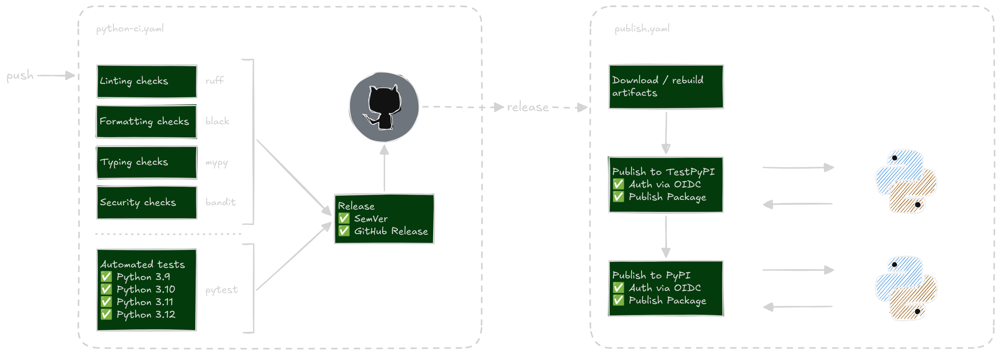

# Python for DevOps: CI/CD for Python Projects

This repo contains the code for the CI/CD section of my Python for DevOps course.

It packages a small command-line tool, `check-urls`, that checks one or more URLs
and prints their HTTP status.

## Workflow



## What we will implement in this repository

- [x] Implement the project (code files)
- [x] Add a simple GHA workflow and make sure it runs until completion
- [x] Add linting (ruff) and format checks (black)
- [x] Add typing (mypy) and security checks (bandit)
- [x] Add test automation
- [x] Build our Python project
- [x] Publish the project to both TestPyPI and PyPI when a new release is published

## Installation

Install the package from PyPI:

```bash
pip install simple-http-checker-PedroLima
```

Install from TestPyPI:

```bash
pip install --index-url https://test.pypi.org/simple/ simple-http-checker-PedroLima
```

For local development, clone the repository and install it in editable mode:

```bash
git clone <repo-url>
cd python-devops-cicd-project
python -m venv .venv
source .venv/bin/activate
pip install -e ".[dev]"
```

## Usage

Check a single URL:

```bash
check-urls https://httpbin.org/status/200
```

Check multiple URLs:

```bash
check-urls https://httpbin.org/status/200 https://httpbin.org/status/404 https://httpbin.org/status/500
```

Set a custom timeout in seconds:

```bash
check-urls https://httpbin.org/delay/2 --timeout 5
```

Enable verbose logging:

```bash
check-urls https://httpbin.org/status/200 --verbose
```

Example output:

```text
--- Results ---
https://httpbin.org/status/200             -> 200 OK
https://httpbin.org/status/404             -> 404 NOT FOUND
https://httpbin.org/status/500             -> 500 INTERNAL SERVER ERROR
```

## Development

Install development dependencies:

```bash
pip install -e ".[dev]"
```

Run linting, formatting, typing, security checks, and tests:

```bash
ruff check .
black --check .
mypy src/
bandit -c pyproject.toml -r .
pytest
```

## Package Info

- Package name: `simple-http-checker-PedroLima`
- CLI command: `check-urls`
- Python version: `>=3.9`
